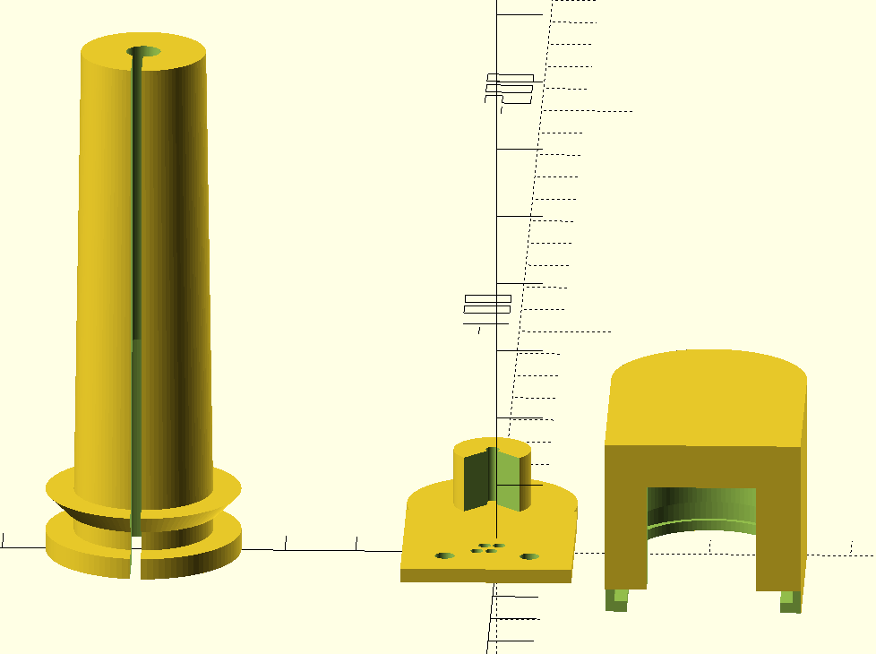

# 3D printable parts for Grant air source heat pump installation

This repository contains 3D printer files for components suitable for
central heating using a Grant Aerona3 air source heat pump.

## Thermistor mount

The Grant/Chofu heat pump supports thermistors in both the hot water
cylinder and in the buffer tank.  According to the [service
manual](https://github.com/aerona-chofu-ashp/docs/blob/main/Chofu/R32/SERVICE%20MANUAL_AEYC-xx42%2C-xx43XU-GR%20(RA-98(5)).pdf)
they are NTC 10K, 1% with beta=3435.

This design is intended for 80mm x 4mm probes which were sourced from
Aliexpress 'Funny Bunny's Instruments Store':

[NTC B3435 10K Thermistor Temperature Sensor NTC 10K Probe 4mm * 80mm Max. 150°C for STC-1000 STC-3008](https://www.aliexpress.com/item/32882640194.html)

It mounts the probe in a 20mm thermostat pocket in the cylinder, and
attaches an RJ11 socket to the end, so that standard twisted pair telephone
or ethernet wiring can be used to wire it back to the ASHP.  The socket is a
generic Chinese:

[JIUYUANCHUNJJ 15 Pcs RJ11 PCB Jacks Universal RJ11 Socket Female Jacks 6P4PCB RJ11 Telephone Female Connectors for Landline Phones Home Appliances Digital Products](https://www.amazon.co.uk/JIUYUANCHUNJJ-Universal-Telephone-Connectors-Appliances/dp/B0BFXHWNCM/)

with the following pin spacing:

but other parts can be used if the footprint is adjusted.

### Components

The 3D printed design comprises three pieces:

1.  a boss which inserts into a 20mm thermostat pocket on the cylinder, into which
1b. an M5 stainless steel screw holds the probe in place
2.  a base piece which presses into the boss, on which
2b. an RJ11 connector is mounted, and the probe soldered to the middle
    pins of the RJ11 (so that a standard twisted pair telephone cable can be used)
3. a cover to slide over piece (2) to protect the wiring

The design was printed in white PLA with a 0.6mm nozzle - ABS might have
been better for its higher temperature properties, but PLA worked
acceptably.  It may be necessary to adjust tolerance values for different
filaments or 3D printers.

### Enabling

The Aerona3 ASHP accepts the hot water thermistor on terminals 7 and 8, and
the buffer tank thermistor on terminals 11 and 12.

The hot water thermistor is enabled on the ASHP room controller by changing
setting 51-07 to 1.  This enables the thermistor to be read via Modbus or on
the room controller via setting 01-31.  If the room controller is driving
hot water programs, rather than the external Grant relay box, then this
thermistor is used for deciding whether the hot water has reached 'eco',
'comfort' or 'boost' temperatures, and for running the weekly legionella
cycle.

The buffer tank thermistor is enabled by setting 51-11 to 1.  However care
is required, because enabling it can affect heating profile of
the ASHP and how it runs the main water pump.  It can cause the ASHP to
maintain the buffer temperature irrespective of heat requirement of the house. 
See section 7.2.4 of the
[Chofu operating instructions](https://github.com/aerona-chofu-ashp/docs/blob/main/Chofu/R32/New-Zealand/Chofu-Operating-Installation-Manual-R32.pdf).
For now it is not recommended to enable the buffer probe.
